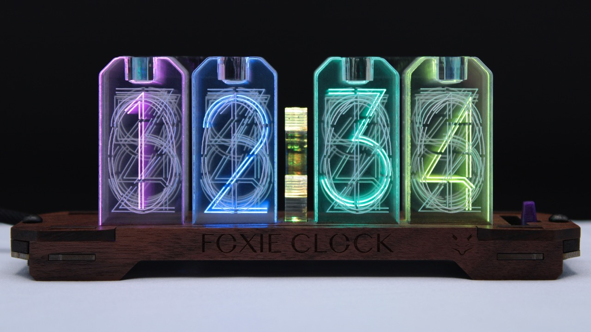
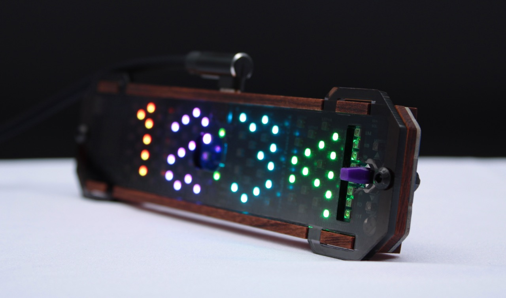
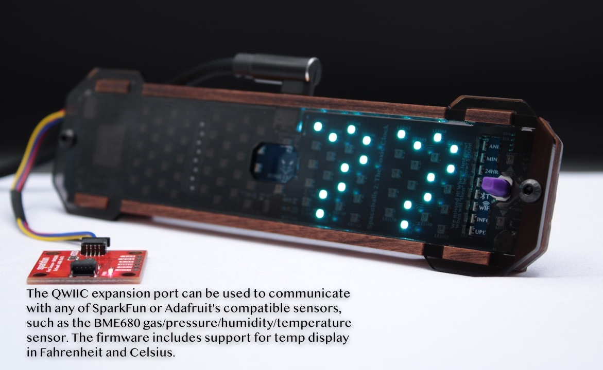

# Foxie Clock 2.0  

This is a certified Open Source Hardware ([OSHW US002126](https://certification.oshwa.org/us002126.html)) clock that you are going to love. It is much more than the sum of its parts, including innovative features like built-in online firmware updates, a modern 160Mhz RISC-V processor that has WiFi (and BLE, though not yet supported), lots of configurability, time memory, light level awareness, built-in LED filter in the lid, and much, much more. 

#### Powered by FCOS
This is the firmware underpinning all the cool functionality. See [github.com/foxieproducts/fcos](https://github.com/foxieproducts/fcos) for a thorough rundown of [how to navigate](https://github.com/foxieproducts/fcos) the clock's streamlined interface.

## Unplug your clock to move it?
Uses a modern USB-C connector. The time is remembered for more than 2 days,
with no need to ever replace a battery. What a time to be alive, right?

## Nostalgia to the Max 
The old digits smoothly fade out as each new one arrives, nostalgically
imitating old nixie tubes. Unlike those tubes, these LEDs are reliable, low
voltage, extremely efficient, can be any color, and also can be dimmed
in dark environments.

## Built-in light sensor
Smart, automagical brightness control. The digits also are proportionally lit more brightly toward the back to accommodate shining through multiple layers of acrylic.

## Bright light filter
In addition to holding all the acrylic digits in place, the top piece functions as an LED filter with louvers that almost completely hides the extremely bright LEDs from being seen.

## PXL mode for the pixels!
Everyone loves pixelation at the right time. The Foxie Clock 2.0 can be set into PXL mode and the lid can be swapped for a totally different experience.

## Multiple animation styles, online updates, and more?
There are multiple animation styles, WiFi online updates, and even expansion capabilities.

The PCB is a simple, 2-layer single-sided PCB, using 92 LEDs, a hilariously powerful 160Mhz RISC-V Espressif ESP32-C3-MINI processor with 320KB RAM and 4MB flash. Then an external Real Time Clock, with a 32.768Khz Qwartz crystal, with a dedicated supercapacitor backup is added, just to make sure you don't lose the time. There's no glue, and only two nuts+bolts are used to hold together the entire clock. Take it apart, customize it, make it your own.

## How can you get yours?
Buy one at [tindie.com](https://www.tindie.com/stores/foxieproducts/) or at [foxieproducts.com](https://foxieproducts.com).

## Expansion
There are two expansion ports, including a QWIIC expansion port (use any of [SparkFun's](https://www.sparkfun.com/search/results?term=qwiic+sensor) or [Adafruit's](https://www.adafruit.com/?q=qwiic+sensor&sort=BestMatch) sensors, or the 8-pin expansion port including `GND`, `5V`, `3.3v`, `SDA`, `SCL`, and `3` GPI (or `1` + `UART TX/RX`).

